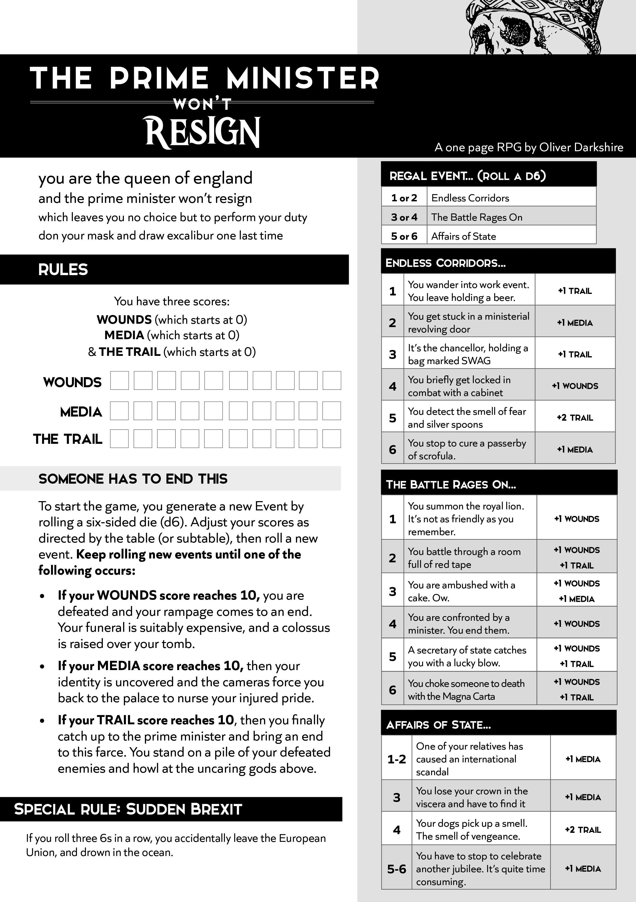

made with `npm init vite`, using the `svelte` option.

Lovingly adapted from Oliver Darkshire (@deathbybadger on twitter)'s one page rpg:

[Original Source](https://twitter.com/deathbybadger/status/1545372201402114049)